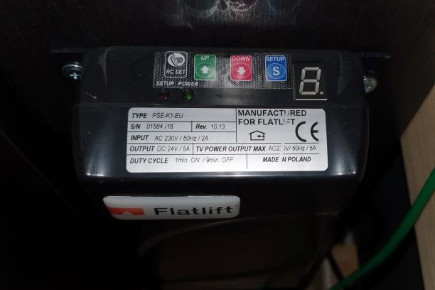

# esp8266 Homeyduino dualrelay and on/off sensor
A simple WLAN-configurable dualrelay for Homey home automation using Homeyduino-library from Athom. In this particular case the relays are used to send a short pulse to a [Flatlift Budget motorized TV Lift](https://flatlift.com/en). One relay for an UP-pulse and the other relay for a DOWN-pulse. There is also on input for a microswitch to detect if the TV lift is in the down position.

## Hardware prerequisities
- An esp8266 board
- dual relay board
- microswitch
- some breadboad
- wire/cables
- enclosure to fit them all

## Software prerequisities
- [Arduino IDE](https://www.arduino.cc/en/main/software)
- [Arduino ESP8266 filesystem uploader](https://github.com/esp8266/arduino-esp8266fs-plugin)
- [Homeyduino-library from Athom](https://homey.app/en-us/app/com.athom.homeyduino/Homeyduino/)

Required libraries:

ESP8266WiFi, ESP8266WiFiMulti,  ESP8266HTTPClient, WiFiClientSecure,
WiFiClient, DNSServer, ESP8266WebServer, FS, Homeyduino

Use the filesystem uploader tool to upload the contents of data library. It contains the html pages for
the configuring portal.

## Connections
Connect the relay boards relays to pins D1 and D2 and the microswitch to D5. These can also be configured with in the code.
```
#define TV_DOWN   PIN_D1        // TVlift down, pulse for 500 msec
#define TV_UP     PIN_D2        // TVlift up, pulse for 500 msec
#define TV_STATE  PIN_D5        // TVlift state, open/low = down, closed/high = up
```

For the microswitch, place a 10k resistor between ground and the pin you chose for TV_STATE (D5). the other end of the switch connects to 3V3.

You can connect a switch between D6 and GND. If D6 is grounded, the esp8266 starts portal mode. The pin can be
also changed from the code, see row `#define APREQUEST PIN_D6`

## Homey
The Homey side of this code brings an onoff capability that can be used in Homey flow cards.

The out of the box Homeyduino cards are:
Trigger cards:
- Turned on / off
- All triggers
- Trigger `[number]`
- Trigger `[text]`
- Trigger `[boolean]`
- Trigger
- Digital input
- Analog input
Condition cards:
- Is turned on
- Condition `[number]`
- Condition `[text]`
- `?` Condition `[boolean]`
- Condition
- Digital pin
- Analog input is greater than
- Analog input equals
Action cards:
- Turn on / off
- Toggle on or off
- Action `[number]`
- Action `[text]`
- `?` Action `[boolean]`
- Action
- `?` Digital output
- Digital output: ON
- Digital output: OFF
- Analog output

In this configuration only the on and off cards are used. Based on the microswitch state, when the TV lift is up the onoff capability is set to true (ON) and when thet TV lift is down it is set false (OFF). Using action "Turn on" will pulse the "Up" relay for 200 ms, and action "Turn off" will pulse the "Down" relay for 200 ms.

## Portal mode
When your board is in portal mode, it blinks both onboard LEDs. Take your phone and connect to WiFi network 
**ESP8266 HOMEY** and accept that there's no internet connection etc.

Open your browser and go to `http://192.168.4.1/`

The web GUI should be self explanatory.

There's almost no sanity checks for the data sent from the forms. This is not a public web service and if you
want to mess up your board or make a denial of service to it using eg. buffer overflows, feel free to do so.

Currently the configuration portal only configures the WiFi. Plans are to add Homey device name configuation also.

Credits for the configuration portal mode goes to [Mikko](https://github.com/oh2mp/).

### Configuration files
The portal saves all configurations onto the SPIFFS filesystem. They are just text files, so you can precreate them and then your ESP8266 Homey TV Lift is preconfigured and you dont' have to use the portal at all. Just place yout configuration files into the data directory along the html files and upload them with ESP filesystem uploader.

See [FORMATS.md](FORMATS.md).

## Some pics of the project


